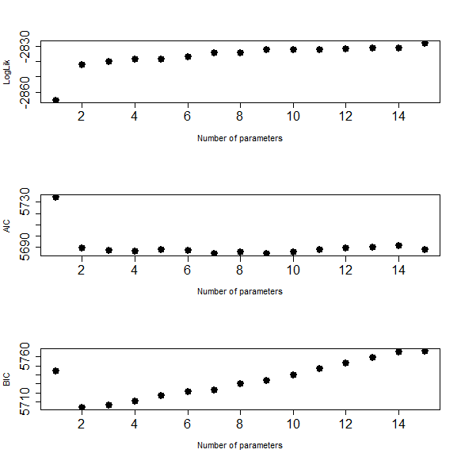
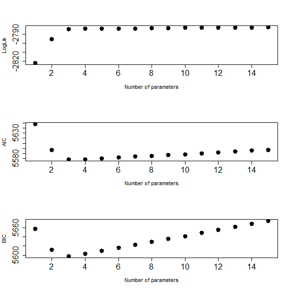
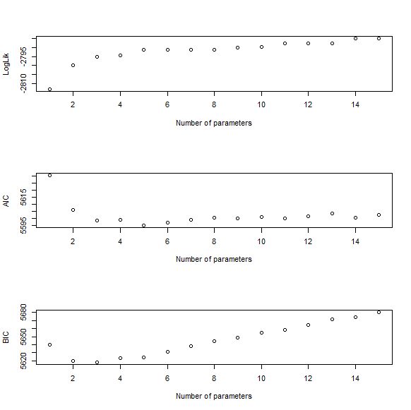

[](http://quantlet.de/index.php?p=info)

## [](http://quantlet.de/) **ICplots** [](http://quantlet.de/d3/ia)

```yaml

Name of Quantlet : ICplots

Published in : Model Selection - AIC & BIC

Description : ICplots gives 3 plots which are an example how different AIC and BIC perform.

Keywords : Information Criteria, AIC, BIC, Model Selection, plot

See also : CRIXcode

Author : Simon Trimborn

Submitted : Tue, August 30 2016 by Simon Trimborn

Example : '3 plots with different seeds for the random numbers on which the Likelihood, AIC and BIC
are computed.'

```








### R Code:
```r
for (j in c(1,1000,10000)){
  set.seed(j)
  epsilon = rnorm(1000,0,4)
  mu      = 0.5
  y       = mu + epsilon[-1] + 0.5 * epsilon[-length(epsilon)]
  LogLik  = c()
  aic     = c()
  bic     = c()
  for (i in 1:15){
    model     = arima(y, order = c(i,0,0), include.mean = F)
    LogLik[i] = model$loglik
    aic[i]    = AIC(model, k = 2)
    bic[i]    = BIC(model)
  }

  dev.new()
  par(mfrow = c(3,1))
  plot(LogLik, xlab = "Number of parameters", ylab = "LogLik", lwd = 5, 
    pch = 19, xaxt = "n", yaxt = "n")
  axis(1, cex.axis = 1.5)
  axis(2, cex.axis = 1.5)
  plot(aic, xlab = "Number of parameters", ylab = "AIC", lwd = 5, 
    pch = 19, xaxt = "n", yaxt = "n")
  axis(1, cex.axis = 1.5)
  axis(2, cex.axis = 1.5)
  plot(bic, xlab = "Number of parameters", ylab = "BIC", lwd = 5, 
    pch = 19, xaxt = "n", yaxt = "n")
  axis(1, cex.axis = 1.5)
  axis(2, cex.axis = 1.5)
}

```
